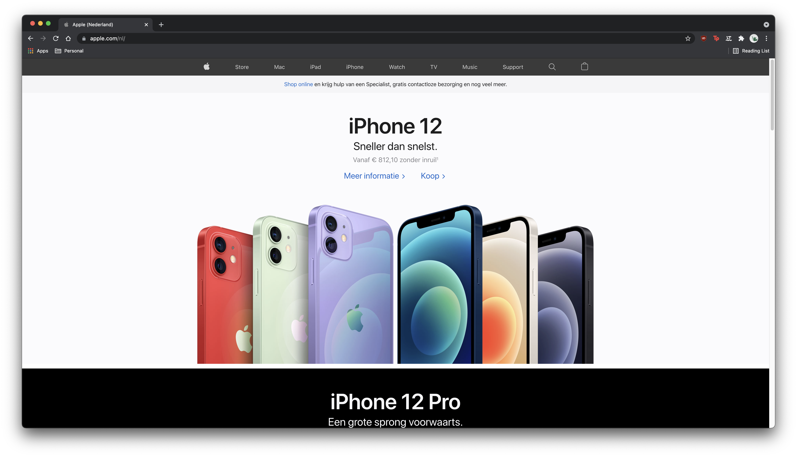
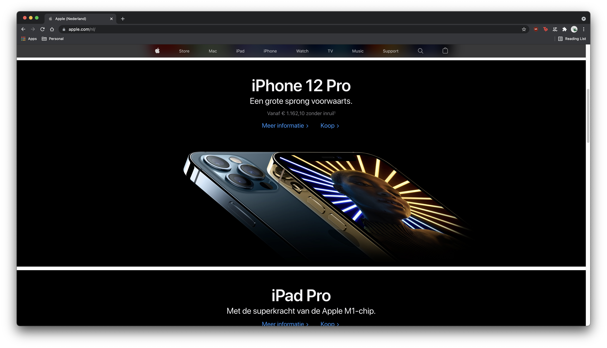
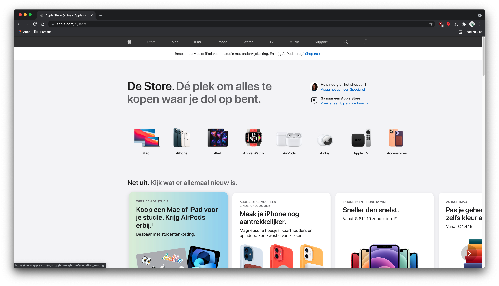
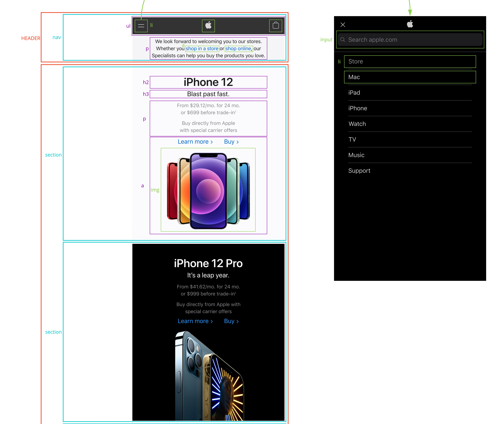
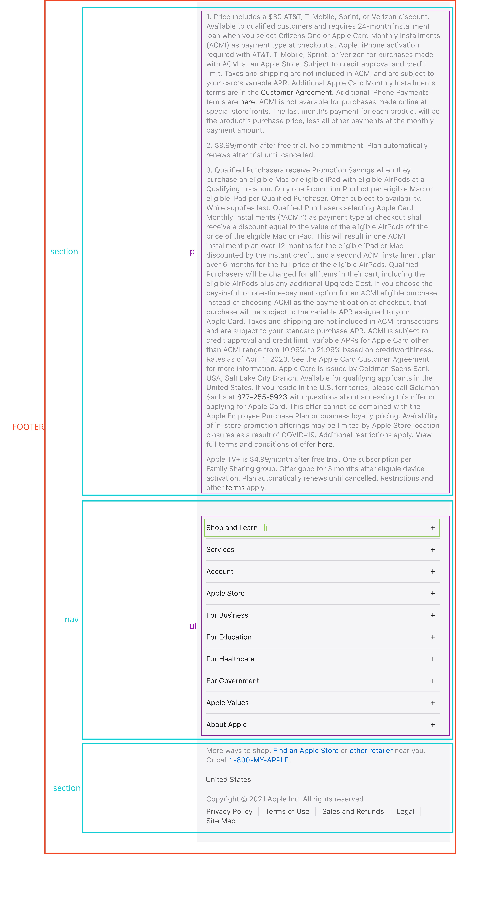
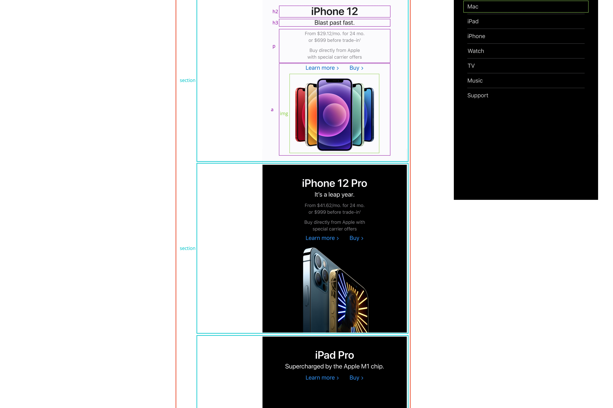

# Procesverslag
Markdown is een simpele manier om HTML te schrijven.  
Markdown cheat cheet: [Hulp bij het schrijven van Markdown](https://github.com/adam-p/markdown-here/wiki/Markdown-Cheatsheet).

Nb. De standaardstructuur en de spartaanse opmaak van de README.md zijn helemaal prima. Het gaat om de inhoud van je procesverslag. Besteedt de tijd voor pracht en praal aan je website.

Nb. Door *open* toe te voegen aan een *details* element kun je deze standaard open zetten. Fijn om dat steeds voor de relevante stuk(ken) te doen.

## Jij

uitwerken voor kick-off werkgroep

### Auteur:
Mitchel Staal

#### Je startniveau:
Blauw, met een poging tot Rood.

#### Je focus:
Responsive
 

## Je website

uitwerken voor kick-off werkgroep

### Je opdracht:
https://www.apple.com/nl/

#### Screenshot(s) van de eerste pagina (small screen): 
Home  
  
  
  

#### Screenshot(s) van de tweede pagina (small screen):
Store  

 

## Breakdownschets (week 1)

uitwerken na afloop 2e werkgroep

### de hele pagina: 

   

### dynamisch deel (bijv menu): 

## Voortgang 1 (week 2)

uitwerken voor 1e voortgang

### Stand van zaken
de goede afmetingen van alle elementen uitzoeken was lastiger dan ik dacht. om deze dan ook nog eens goed overal neer te zetten was ook nog eens een klus. elk element is anders, dus er moet veel unieke styling worden toegevoegd (dit kost nou eenmaal tijd, niet perse moeilijk tho).

### Verslag van meeting
hier na afloop snel de uitkomsten van de meeting vastleggen

- comments neerzetten in de css waar verwarring kan onstaan. bijvoorbeeld; bij de verschillende section waar ik nth heb gebruikt.
- letten op het gebruiken van px..
- meer content zoals foto's.
- voor de rest nette html en css.

## Voortgang 2 (week 3)

uitwerken voor 2e voortgang

### Stand van zaken
het accuraat positioneren van alle elementen was nog wel heel moeilijk. daarnaast ook nog het toevoegen van de background images op elke unieke section.

### Verslag van meeting
hier na afloop snel de uitkomsten van de meeting vastleggen

- footer heeft veel sections, dit kan beter worden gedaan in een article.
- de class 'location' nog wat te onduidelijk. class names mogen gewoon langer zijn als ze maar duidelijk zijn.
- beginnen met javascript.
- zorgen dat de eerste pagina helemaal af is.

## Toegankelijkheidstest (week 4)

uitwerken na test in 8e voortgang

### Bevindingen
Lijst met je bevindingen die in de test naar voren kwamen:

- bril: colorblind color #0779P, bijna geen verschil, maar overgang van wit op grijs was bijna niet op te merken.
- bril: blur, bijna niks. niks is te zien of te lezen. oplossing: ??
- bril: hemifield loss, bijna geen verschil, alleen nu met een zwarte vlek.
- bril: 

#### Colorblind color #0779P
Hier korte omschrijving (met indien nodig een afbeelding)

Hier een omschrijving van hoe het opgelost kan worden (met indien nodig een afbeelding)

#### Blur
Hier korte omschrijving (met indien nodig een afbeelding)

Hier een omschrijving van hoe het opgelost kan worden (met indien nodig een afbeelding)

#### Hemifield loss
Hier korte omschrijving (met indien nodig een afbeelding)

Hier een omschrijving van hoe het opgelost kan worden (met indien nodig een afbeelding)

## Voortgang 3 (week 4)

uitwerken voor 3e voortgang

### Stand van zaken
hier dit ging goed & dit was lastig (neem ook screenshots op van delen van je website en code)

### Verslag van meeting
hier na afloop snel de uitkomsten van de meeting vastleggen

- punt 1
- punt 2
- nog een punt
- ...

## Eindgesprek (week 5)

uitwerken voor eindgesprek

### Stand van zaken
hier dit ging goed & dit was lastig (neem ook screenshots op van delen van je website en code)

### Screenshot(s)

hier screenshot(s) van je eindresultaat

## Bronnenlijst

continu bijhouden terwijl je werkt

Nb. Wees specifiek ('css-tricks' als bron is bijv. niet specifiek genoeg).

1. bron 1
2. bron 2
3. ...

